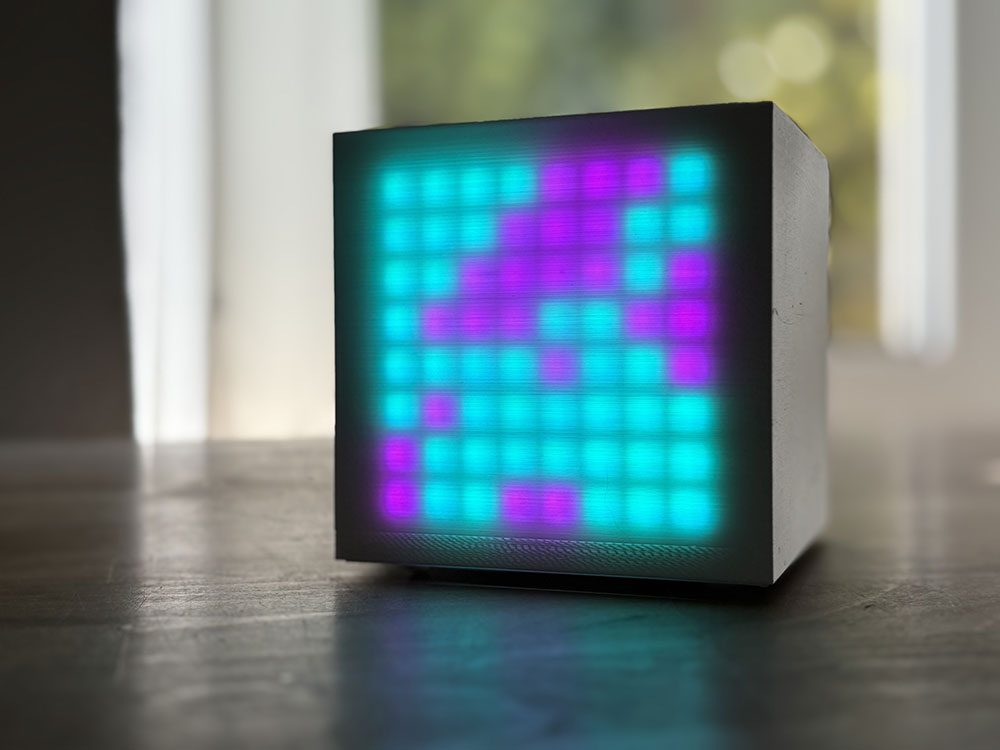

# LED matrix

- [Hardware](#hardware)
- [Connect LED matrix to Pi](#connect-led-matrix-to-pi)
- [Install](#install)
- [Modes](#modes)
- [Change mode](#change-mode)
- [Change brightness](#change-brightness)
- [Update](#update)

## Hardware

- Raspberry Pi; I use a Pi Zero WH but any Pi will probably do just fine (other models might not fit in the case)
- LED matrix; WS2812B-64 (8x8 RGB LED matrix)
- Power supply for the Pi
- Optional: 3D printed case; see [case](https://github.com/rickvanderwolk/led-matrix/tree/main/case)

## Connect LED matrix to Pi

| WS2812B Matrix Pin | Function   | Connect to Raspberry Pi Pin | Raspberry Pi GPIO |
| ------------------ | ---------- | --------------------------- | ----------------- |
| **V+**             | Power (5V) | Pin **2**                   | 5V                |
| **V-**             | Ground     | Pin **6**                   | GND               |
| **IN**             | Data In    | Pin **12**                  | **GPIO18**        |

## Install

1. Install Raspberry Pi OS on a SD card. You can easily choose the right image and setup a username / password, Wi-Fi and enable SSH with the [Raspberry Pi OS imager](https://www.raspberrypi.com/software/). I've used the latest recommended image `Raspberry Pi OS Lite (32-bit) - Release date 2025-05-13 - A port of Debian Bookworm with no desktop environment` in the example below, but I recommend just installing the latest recommended version.
2. Boot the Pi (might take a while depending on which Pi you're using)
3. Connect via SSH `ssh <username>@<your-pi-host-or-ip>`
4. Install git `sudo apt install -y git`
4. Clone repository `git clone https://github.com/rickvanderwolk/led-matrix.git`
5. Run install script `bash led-matrix/install.sh` (might take a while)

You're all set, the LED matrix will start automatically.

## Modes

- [evolving-square](https://github.com/rickvanderwolk/led-matrix/tree/main/modes/evolving-square)
- [led-sort](https://github.com/rickvanderwolk/led-matrix/tree/main/modes/led-sort)
- [ntfy-sh](https://github.com/rickvanderwolk/led-matrix/tree/main/modes/ntfy-sh)
- [pathfinder](https://github.com/rickvanderwolk/led-matrix/tree/main/modes/pathfinder)
- [pixels-fighting](https://github.com/rickvanderwolk/led-matrix/tree/main/modes/pixels-fighting)
- [quadrant-clock-with-pomodoro-timer](https://github.com/rickvanderwolk/led-matrix/tree/main/modes/quadrant-clock-with-pomodoro-timer)

## Change mode

Change `selected_mode` in `config.json`. For example: `{"selected_mode": "evolving-square"}` (use the directory name of the mode in the `modes` directory). 

Restart service with `sudo systemctl restart ledmatrix.service`

## Change brightness

Change `brightness` in `config.json`. For example: `{"brightness": 0.25}` (use 0 to 1).

Restart service with `sudo systemctl restart ledmatrix.service`

## Update

Update to latest version. 

`cd ~/led-matrix && git pull && bash install.sh`
