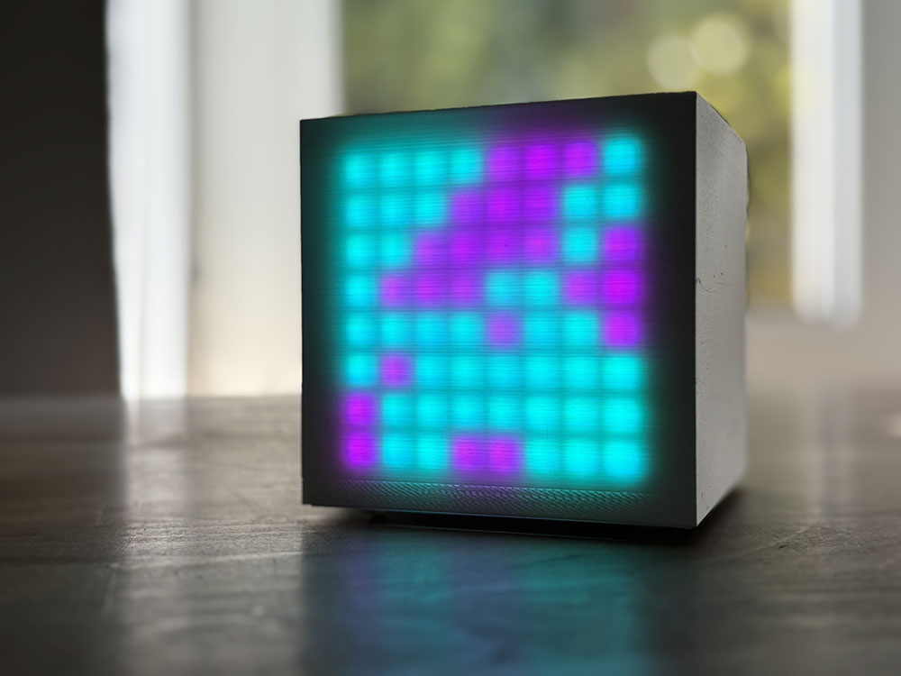

# LED matrix



A Python (Raspberry Pi) project to control an 8x8 LED matrix with various visualization modes. Display a clock, sorting algorithms, color battles, remote control via ntfy.sh, and more.

- [Hardware](#hardware)
- [Connect LED matrix to Pi](#connect-led-matrix-to-pi)
- [Install](#install)
- [Modes](#modes)
- [Change mode](#change-mode)
- [Change brightness](#change-brightness)
- [Schedule](#schedule)
- [Display orientation](#display)
- [Create a mode](#create-a-mode)
- [Update](#update)

<a id="hardware"></a>
## Hardware

- Raspberry Pi; I use a Pi Zero WH but any Pi will probably do just fine (other models might not fit in the case)
- LED matrix; WS2812B-64 (8x8 RGB LED matrix)
- Power supply for the Pi
- Optional: 3D printed case; see [case](https://github.com/rickvanderwolk/led-matrix/tree/main/case)

<a id="connect-led-matrix-to-pi"></a>
## Connect LED matrix to Pi

| WS2812B Matrix Pin | Function   | Connect to Raspberry Pi Pin | Raspberry Pi GPIO |
| ------------------ | ---------- | --------------------------- | ----------------- |
| **V+**             | Power (5V) | Pin **2**                   | 5V                |
| **V-**             | Ground     | Pin **6**                   | GND               |
| **IN**             | Data In    | Pin **12**                  | **GPIO18**        |

<a id="install"></a>
## Install

1. Install Raspberry Pi OS on a SD card. You can easily choose the right image and setup a username / password, Wi-Fi and enable SSH with the [Raspberry Pi OS imager](https://www.raspberrypi.com/software/). I've used the latest recommended image `Raspberry Pi OS Lite (32-bit) - Release date 2025-05-13 - A port of Debian Bookworm with no desktop environment` in the example below, but I recommend just installing the latest recommended version.
2. Boot the Pi (might take a while depending on which Pi you're using)
3. Connect via SSH `ssh <username>@<your-pi-host-or-ip>`
4. Install git `sudo apt install -y git`
5. Clone repository `git clone https://github.com/rickvanderwolk/led-matrix.git`
6. Run install script `bash led-matrix/install.sh` (might take a while)

You're all set, the LED matrix will start automatically.

<a id="modes"></a>
## Modes

- [clock](https://github.com/rickvanderwolk/led-matrix/tree/main/modes/clock) - 4-quadrant clock with Pomodoro timer
- [collision](https://github.com/rickvanderwolk/led-matrix/tree/main/modes/collision) - Colorful particle collisions with mixed color explosions
- [evolving-square](https://github.com/rickvanderwolk/led-matrix/tree/main/modes/evolving-square) - Randomly evolving colored pixels
- [led-sort](https://github.com/rickvanderwolk/led-matrix/tree/main/modes/led-sort) - Visualize sorting algorithms
- [ntfy-sh](https://github.com/rickvanderwolk/led-matrix/tree/main/modes/ntfy-sh) - Remote control via ntfy.sh
- [pathfinder](https://github.com/rickvanderwolk/led-matrix/tree/main/modes/pathfinder) - Pathfinding algorithm visualization
- [pixels-fighting](https://github.com/rickvanderwolk/led-matrix/tree/main/modes/pixels-fighting) - Color battle simulation

<a id="change-mode"></a>
## Change mode

Change `selected_mode` in `config.json`. For example: `{"selected_mode": "evolving-square"}` (use the directory name of the mode in the `modes` directory). 

Changes to `config.json` are picked up automatically within a few seconds, no restart needed.

<a id="change-brightness"></a>
## Change brightness

Change `brightness` in `config.json`. For example: `{"brightness": 0.25}` (use 0 to 1, 0 is off).

Brightness changes are applied to the running mode without restarting it.

<a id="schedule"></a>
## Schedule

Change any config value at set times, for example to dim the matrix in the evening and switch it off at night.

```json
{
  "selected_mode": "clock",
  "brightness": 0.2,
  "schedule": [
    { "from": "07:00", "brightness": 0.2, "selected_mode": "clock" },
    { "from": "19:00", "selected_mode": "collision" },
    { "from": "21:30", "brightness": 0.05 },
    { "from": "23:00", "brightness": 0 }
  ]
}
```

Each entry overrides the keys it contains, from its `from` time until a later entry changes them again (wrapping around midnight). In the example above collision keeps running at 21:30, only dimmer. Entries can contain anything the config can, including mode settings like `"modes": {"led-sort": {...}}`.

The schedule uses the Pi's system time, so make sure the time zone is set (`sudo raspi-config` > Localisation Options > Timezone).

<a id="display"></a>
## Display orientation

If the matrix is mounted rotated or mirrored:

```json
{
  "display": { "rotate": 90, "flip_x": false, "flip_y": false }
}
```

`rotate` is clockwise: 0, 90, 180 or 270. Optionally add `"gamma": 2.2` for smoother fades (off by default, as it makes the existing mode colors darker).

<a id="create-a-mode"></a>
## Create a mode

A mode is a directory in `modes/` with a `main.py`. The `core` package takes care of the hardware, config, brightness, schedule, orientation and switching the LEDs off on exit, so a mode only has to draw:

```python
from core import Matrix, hsv

matrix = Matrix()

for frame in matrix.frames(fps=30):
    matrix.clear()
    matrix[frame % 8, 3] = hsv(frame / 64)
```

- `matrix[x, y] = (r, g, b)` or `matrix[index]` (row by row, 0 is top left). Writes outside the matrix are ignored, reads return `None`.
- `matrix.fill(color)`, `matrix.clear()`, `matrix.neighbors(x, y)`, `matrix.width`, `matrix.height`, `matrix.count`
- `matrix.frames(fps)` loops at a steady frame rate and shows each frame. For modes that don't fit a frame loop, call `matrix.show()` yourself (unchanged frames are skipped, so calling it often is cheap).
- `matrix.settings` holds this mode's settings from `config.json` (`"modes": {"<mode-name>": {...}}`).
- Color helpers: `hsv(h, s, v)`, `mix(color1, color2, t)`, `scale(color, factor)`, `BLACK`, `WHITE`.

Try it without hardware using the [visualizer](https://github.com/rickvanderwolk/led-matrix/tree/main/visualizer).

<a id="update"></a>
## Update

Update to latest version. 

`cd ~/led-matrix && git pull && bash install.sh`
